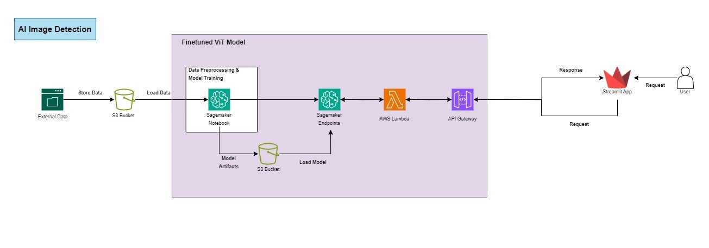
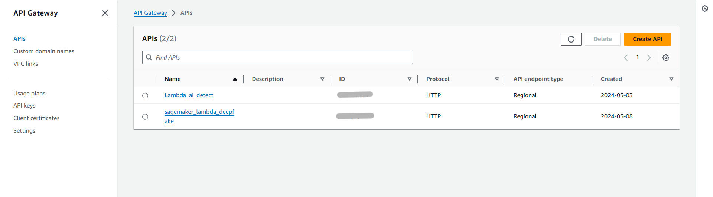
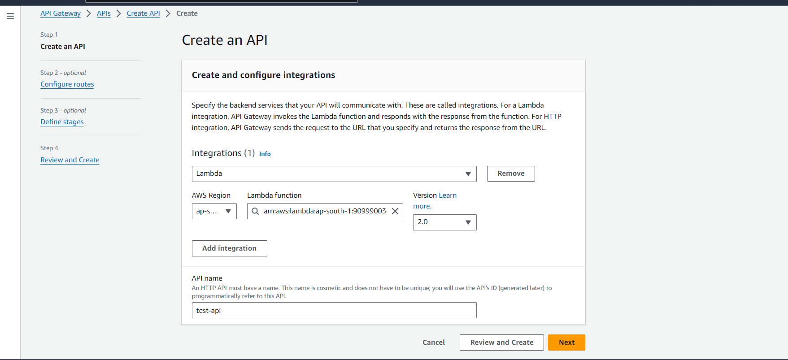
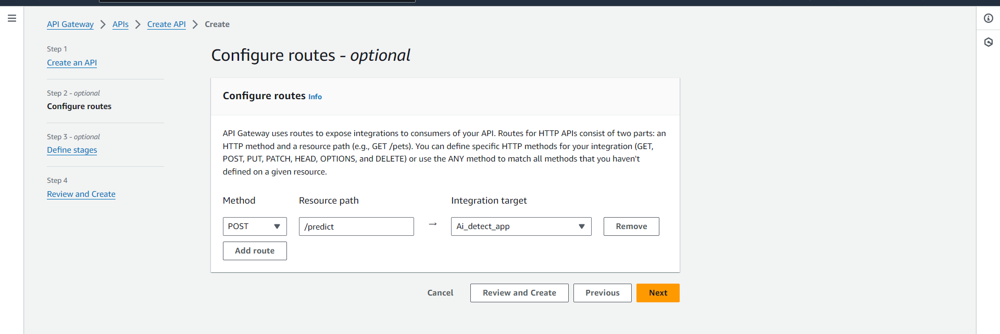
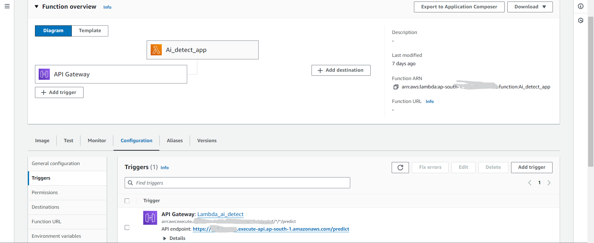

# Finetuned ViT Model Deployement for Text Classification
For this deployement, the ViT transformer based model (google/vit-base-patch16-224-in21k) was finetuned on custom task specific dataset for image classification.

## AWS Architecture



The above architecture was used for the deployement of the Finetuned ViT Model. The image data was collected and uploaded to s3. The model was trained in SageMaker Notebook instance using Huggingface SDK. Then the trained model artifacts were stored in another s3 bucket for future use. The model was deployed using SageMaker endpoints and then Lambda function was created to interact with this endpoint. At the end, API Gateway was used to send the user request to Lambda and get the response back to user.

## Instructions

Here, I have not explained the training part in detail. You could use any method to train your model such as EC2, Local machine etc and store your model artifacts to s3 or upload it to Huggingface to create Sagemaker endpoints.

### 1. Load your model in SageMaker notebook and create endpoints
Create a notebook instance. Open a jupyter notebook and create a function as shown below to deploy your model as sagemaker endpoints

```
def create_endpoint(self):
    sess = sagemaker.Session()
    training_image = get_image_uri(sess.boto_region_name, 'image-classification', repo_version="latest")        
    role = "YOUR_ROLE_ARN_WITH_SAGEMAKER_EXECUTION"
    model = "s3://BUCKET/PREFIX/.../output/model.tar.gz"

    sm_model = sagemaker.Model(model_data=model, image=training_image, role=role, sagemaker_session=sess)
    sm_model.deploy(initial_instance_count=1, instance_type='ml.p3.2xlarge')

```
This will create a sagemaker endpoints for you model. This endpoints are not publicly accessible. In order to access them publicly, we need to connect it with API gateway.

As we need to preprocess the User request before invoking sagemaker endpoints, we will use Lambda.

### 2. Create Lambda function and connect it with sagemaker endpoint
Open the Lambda dashboard and create new lambda function from scratch. Configure the name, memory and language (python) and create it.

Once the lambda function is created, go to the code sections and change your lambda_function.py file code. 

For our application, user will be sending the image request, it will be converted to base64 string and gets sent to sagemaker for prediction. See the lambda_function code below:
```
import os
import boto3
import json
import base64

ENDPOINT_NAME = os.environ['endPointName']
runtime= boto3.client("runtime.sagemaker")

def lambda_handler(event, context):
    print(event)
    file_content = base64.b64decode(event['body'])

    payload = file_content
    response = runtime.invoke_endpoint(EndpointName=ENDPOINT_NAME, ContentType="image/jpeg", Body=payload)
    print(response)
    result = json.loads(response["Body"].read().decode())
    print(result)

    return {
      "statusCode": 200,
      "headers": { "content-type": "application/json"},
      "body":  json.dumps(result)
    }
```

Here we are using sagemaker endpoint values as ENDPOINT_NAME which is stored as environment variable as endPointName. 

To create a environment variable in your lambda function, go to configuration -> environment variable and add sagemaker endpoints as your env variable.

### 3. Create API Gateway and connect it with Lambda

Open the API Gateway dashboard and select create API.



Select the HTTP API and select build. You will see the following screen. Click on integration and select your lambda function and give your API any suitable name.



Next on configuration page, in method select POST and Resource path any name. Here for prediction we will select /predict.  



Keep everything default in next pages and select create to create the api gateway.

Your API gateway is ready. Go to your lambda function and you will see your api gateway added to triggers.

Go to the configuration -> triggers and you will see your API endpoints.



Now your api is ready, through which you can interact with your sagemaker endpoints by sending a request. 

### 6. Test your API
Test with Curl. We can use the following curl command to test our API:
```
curl -X POST -H "Content-Type: image/jpeg" --data-binary @<YOUR_LOCAL_IMAGE_PATH> <API-Gateway-URL>
```

If we configure the things correctly, we should see the response like:
{
      "statusCode": 200,
      "headers": { "content-type": "application/json"},
      "body":  [{"score": 0.9148876070976257, "label": "Fake"}, {"score": 0.08511237055063248, "label": "Real"}]
    }


